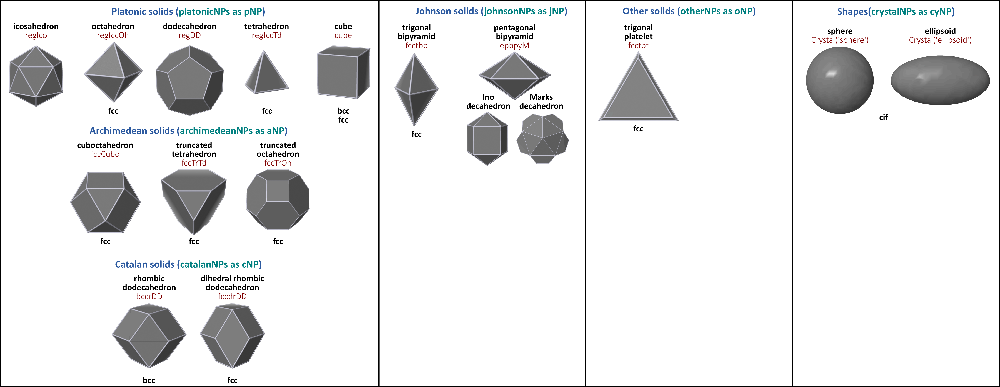

 

Most **nanoparticles** have a well-defined shape. The habit of a crystalline nanoparticle is dependent on its crystallographic form and growth conditions. Its properties depends on its size, shape, surface topology and composition, etc... Modeling nanoparticles at the atomic scale is a crucial preliminary step to evaluate their potential for various applications. However, the process of generating an initial conformation for modeling and simulation is not that easy. Several tools are already available, including in the python realm. But to the best of our knowledge, they do not give access to the fascinating diversity of shapes encountered at the nanoscale. `pyNanoMatBuilder` is a new python tool designed to create nanoparticle models from **any crystal structure** or atomically precise structures, *i.e.* **magic numbers polyhedra**.

Various atomic ordered arrangements can be obtained by instantiating specific classes:

- The `crystalNPs` utility builds several shapes, such as **spheres**, **cubes**, **ellipsoids**, **parallelepipeds**, and more generally any **Wulff constructions**. In addition to the database of cif coordinates, users can upload a cif file. Some pre-defined Wulff constructions are available, and it is also possible to specify the Miller indices and assign the minimum surface energies. This functionality is expected to work for any Bravais lattice.
- Wulff constructions based on Bravais lattices cannot give access to some polyhedra, such as the **icosahedra** or **decahedra** five-fold structures. This is the reason why additional classes generate atomic arrangements of specific atomically precise polyhedra: **platonic NPs**, **archimedean NPs**, **Catalan NPs** and **Johnson NPs**. The corresponding classes do not pretend to be exhaustive, but they provide frequently observed structures.

The crystal habits of the structures generated by `pyNanoMatBuilder` are summarized below:

[**Change Log**](./ChangeLog.md)
